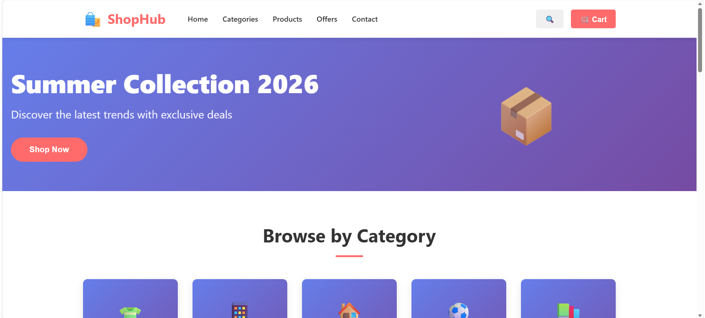
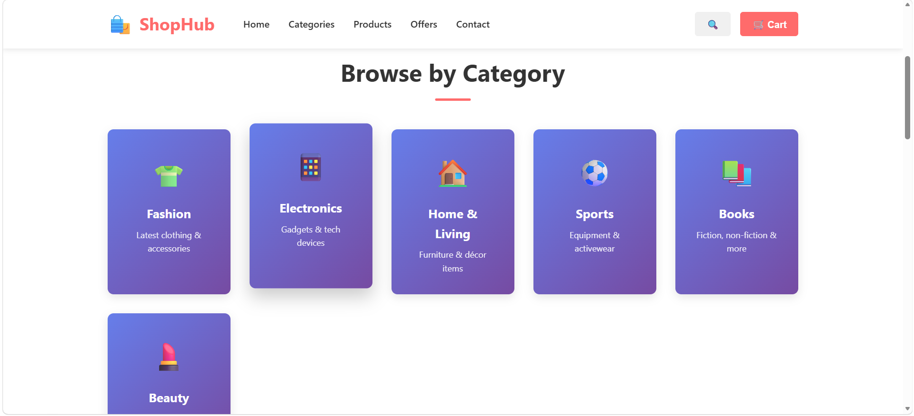
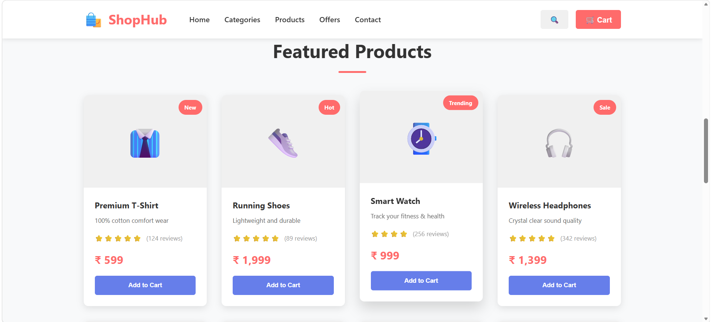
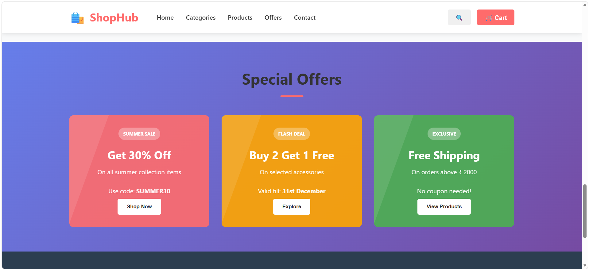

# ShopHub

A professional, responsive e-commerce website built with HTML and CSS, featuring a modern design and excellent user experience.

## Project Overview

ShopHub is a static e-commerce website designed to showcase product listings, categories, special offers, and maintain professional navigation and footer sections. The website is fully responsive and works seamlessly across all devices.

## Project Preview

### Hero Section


### Categories Section


### Products Section


### Offers Section



## Features Implemented

### ✅ Mandatory Sections

1. **Navigation Bar**
   - Logo with icon
   - Navigation links (Home, Categories, Products, Offers, Contact)
   - Search button
   - Shopping cart button
   - Sticky positioning for easy access

2. **Hero Section**
   - Eye-catching gradient background
   - Compelling headline and subtitle
   - Call-to-action button
   - Animated floating icon
   - Two-column responsive layout

3. **Categories Section**
   - 6 product categories with emojis
   - Hover animation effects
   - Gradient backgrounds
   - Responsive grid layout

4. **Product Listing Grid**
   - 8 featured products
   - Product images with emoji placeholders
   - Product badges (New, Hot, Trending, Sale)
   - Star ratings with review counts
   - Pricing display
   - Add to cart buttons
   - Hover animations

5. **Offers/Discount Section**
   - 3 special promotional cards
   - Discount codes and valid dates
   - Color-coded offers (Red, Orange, Green)
   - Shimmer animation effect
   - Clear call-to-action buttons

6. **Footer**
   - 4-column layout with company info
   - About section with social media links
   - Quick links section
   - Customer service section
   - Legal information section
   - Payment methods display
   - Copyright notice

### ✨ Additional Features

- **Fully Responsive Design** - Works on all devices (desktop, tablet, mobile)
- **Modern UI/UX** - Clean, professional design with smooth animations
- **CSS Animations** - Floating elements, hover effects, shimmer animations
- **Color-Coded Elements** - Intuitive visual hierarchy
- **Accessibility** - Semantic HTML for better screen reader support
- **Performance Optimized** - Clean code structure for fast loading

## Folder Structure

```
ShopHub/
│
├── index.html          # Main HTML file with all sections
├── style.css           # Complete CSS styling
├── assets/             # Folder for images/icons (ready for expansion)
└── README.md           # Project documentation
```

## Technologies Used

- **HTML5** - Semantic markup structure
- **CSS3** - Modern styling, gradients, animations, and responsive design
- **Grid & Flexbox** - Advanced layout techniques

## Responsive Breakpoints

The website is optimized for all screen sizes:

- **Desktop**: 1200px and above
- **Tablet**: 768px - 1199px
- **Mobile**: 480px - 767px
- **Extra Small**: Below 480px

## Color Scheme

- **Primary Color**: #ff6b6b (Red)
- **Secondary Color**: #667eea (Purple)
- **Accent Color**: #764ba2 (Dark Purple)
- **Text Color**: #333 (Dark Gray)
- **Background**: #f8f9fa (Light Gray)
- **Footer**: #2c3e50 (Dark Blue)

## How to Use

1. Clone the repository
2. Open index.html in browser
3. The website is fully functional as a static HTML/CSS project

### To Modify:
- Edit `index.html` to change content
- Edit `style.css` to customize colors, fonts, or layout
- Add images to the `assets/` folder for real product images

## Key CSS Features

- **CSS Grid** - For responsive layouts
- **Flexbox** - For component alignment
- **CSS Animations** - Smooth transitions and effects
- **Linear Gradients** - Modern background effects
- **Media Queries** - Mobile-first responsive design
- **CSS Variables Ready** - Structure supports CSS variables for easier theming

## Browser Compatibility

- Chrome (Latest)
- Firefox (Latest)
- Safari (Latest)
- Edge (Latest)
- Mobile browsers (iOS Safari, Chrome Mobile)

## Future Enhancements

Potential features to add with JavaScript:
- Shopping cart functionality
- Product filtering and search
- User authentication
- Product detail pages
- Checkout process
- Review and rating system
- Wishlist feature

## Design Highlights

1. **Hero Section** - Beautiful gradient background with floating animation
2. **Product Cards** - Hover effects with smooth transitions
3. **Offer Cards** - Shimmer animation for visual interest
4. **Smooth Scrolling** - Enhanced navigation experience
5. **Consistent Spacing** - Professional padding and margins throughout
6. **Visual Hierarchy** - Clear distinction between different content sections

## Performance Tips

- Images use emojis (no external image loading)
- Minimal CSS for fast rendering
- Efficient grid layouts
- No external dependencies
- Lightweight and fast-loading

## License

This project is open for educational and personal use.

---

**Version**: 1.0
**Status**: Status: Completed Frontend UI Project


## Connect With Me

- GitHub: https://github.com/Rorychhattish
- YouTube: https://www.youtube.com/@Hackwith36